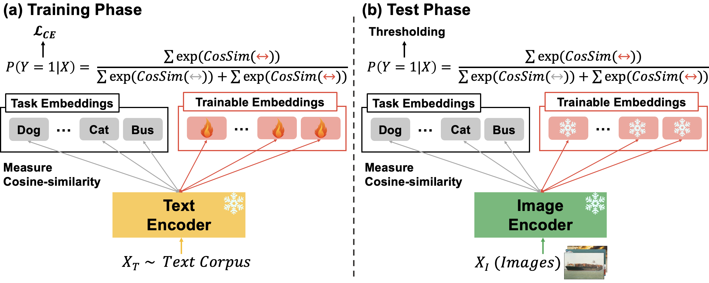

# [NeurIPS 2024] Textual Training for the Hassle-Free Removal of Unwanted Visual Data

This repository is the official implementation of [Textual Training for the Hassle-Free Removal of Unwanted Visual Data](https://arxiv.org/abs/2409.19840), published at NeurIPS 2024.
Our code is based on
1. [PyTorch image classification reference](https://github.com/pytorch/vision/tree/main/references/classification)
2. [CLIP](https://github.com/openai/CLIP)
3. [List Of English Words](https://github.com/dwyl/english-words)

## Overview of our proposed method

Task embeddings define the task to be performed. For example, in the case of hateful image detection, hate speeches would serve as task embeddings, while in OOD detection, the names of classes from the training distribution would be the task embeddings. Trainable embeddings are the only parameters that are trained in our method, defined in the joint embedding space. During the training phase, only textual data are used, and in the testing phase, these trained parameters are employed to classify images.


## Evaluation
1. Please download [ImageNet-1k](https://image-net.org/download.php)
2. Visit this [link](https://github.com/deeplearning-wisc/large_scale_ood) to prepare the inaturalist, sun397, places, and dtd datsets.
3. Download the NINCO dataset [here](https://zenodo.org/record/8013288/files/NINCO_all.tar.gz?download=1)
```
   imagenet
    └── raw-data
   OOD  
    ├── inaturalist                    
    │    └── images          
    │          ├── 000309dd0c724a5104df8e716b9008a0.jpg
    │          └── ...                
    ├── sun397                    
    │    └── images          
    │          ├── sun_aaaevyiuguntlerb.jpg
    │          └── ...
    ├── places                    
    │    └── images          
    │          ├── b_badlands_00000038.jpg
    │          └── ...
    ├── dtd                    
    │    └── images          
    │          ├── banded_0002.jpg
    │          └── ...
    └── NINCO                    
         └── NINCO_OOD_classes          
               └── images
                     ├── amphiuma_means_000_10045958.jpeg
                     └── ...   
```

### MCM
```python

torchrun --rdzv_backend=c10d --rdzv_endpoint=localhost:0 --nnodes=1 --nproc_per_node=1 train.py \
        --mode mcm \
        --model clip-base \ # clip-base, clip-large, blip-base, or blip-large
        --ind imagenet \ # path to in-distribution dataset
        --ood OOD \ # path to a directory containing out-distribution datasets.
        --output-dir logs/{output_dir_name}
```
### HFTT (ours)

```python

torchrun --rdzv_backend=c10d --rdzv_endpoint=localhost:0 --nnodes=1 --nproc_per_node=1 train.py\
        --mode hftt \
        --model clip-base \ # clip-base, clip-large, blip-base, or blip-large
        --ind imagenet \ # path to in-distribution dataset
        --ood OOD \ # path to a directory containing out-distribution datasets.
        --ood-text-path words_alpha.txt \
        --seed 0 \
        --epochs 1 \
        --batch-size 256 \
        --temperature 0.01 \
        --focal 1.0 \
        --num-ood-classes 10 \ # the number of trainable embeddings
        --lr 1.0 \
        --num-eval-in-an-epoch 10 \
        --num-exp 5 \
        --output-dir logs/{output_dir_name}

```
